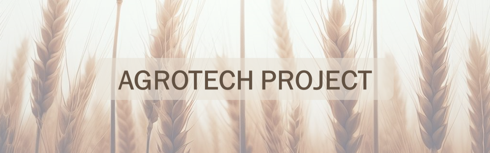

# Analyzing Global Crop Production and Yield Trends: An Agrotechnological Perspective 🌾

  

## Project Objectives
This project will analyse data on different crops worldwide (production, area harvested, yield), as well as data on pesticide use, fertiliser use, average annual rainfall and average temperature in all countries of the world.

The aim of the project is to use data analysis techniques to extract information and visualise the different variables, and to develop a crop recommendation application using machine learning techniques.

*Data source:*

- [*FAOSTAT: Food and Agriculture Organization of the United Nations*](https://www.fao.org/faostat/en/#release_calendar)
- [*The world bank*](https://databank.worldbank.org/)
- *https://tradingeconomics.com/country-list/temperature*

---

## Project structure

The project consists of the following files:

- ``/Data/``: Folder available on the Google Drive link [Data](https://drive.google.com/drive/folders/1YNj80AnFaNC3GuXIMYGxBIITjxB3YKO6?usp=drive_link), containing the data files in csv format.

- ``/models/``: Folder available on the Google Drive link [models](https://drive.google.com/drive/folders/1UXQyxmJeZ7ec-qsOd3Ks3UAUc2zSUKle?usp=drive_link), containing the trained classification and regression models in pkl format.

- ``/notebooks/``: Folder containing different Jupyter Notebooks with all the code used to perform the data analysis (preprocessing, EDA, ML model evaluation) and explanations of each step.

- ``agrotech.py`` : Python script for the Streamlit app.

- ``/img/``: Folder containing images and graphics developed in the project.

- ``/html/``: Folder containing interactive graphics developed in the project.

- ``/outputs/``: Folder containing various .json and .pkl files used in the development of the project.

---

## Characteristics of the project

- **Code**: The code used is in the notebook proyecto_airbnb.ipynb and includes the following sections:
    - Library loading and reading of the different datasets.
    - Datasets information and preprocessing.
    - Exploratory data analysis (EDA), including visualisation of interactive maps and other graphics.
    - Implementation of machine learning models for the prediction of the best crop (classification model) and crop yields (regression model).

**Streamlit application**: An interactive application has been developed using Streamlit, which allows exploration and visualisation of the analysed data. It is deployed at (https://agrotechproject00.streamlit.app/). **Note👁️: make sure the app has finished running before exploring it!!**

- **PowerBI analysis**: A complementary analysis was performed using Power BI to create an interactive dashboard to explore and understand patterns and trends in the fertilizers data. This dashboard is located within the Streamlit application.

---

## Running Instructions 💻
To run this project on your local machine, follow the steps below:

1. Clone this repository to your local machine.
2. Download the ``Data`` and ``models`` folders from Google Drive.
3. Install the necessary dependencies by running pip install -r requirements.txt.
4. Run the agrotech.py file and make sure you have downloaded the **Data**, **models**, **img**, **html** and **outputs** folders in the same environment. Next, open the terminal in the app directory and run the following command: ``streamlit run agrotech.py``.This will open the web browser http://localhost:8501/ which will take you to the app.

"The project aims to use data analysis skills (extract data, preprocessing, exploratory data analysis, implementation of machine learning models) to develop a crop recommendation and crop yield prediction application.

Project to analyze datasets to develop critical analysis skills. Tasks include data requirements identification, data processing, exploratory data analysis, Streamlit app development, Power BI integration and others.